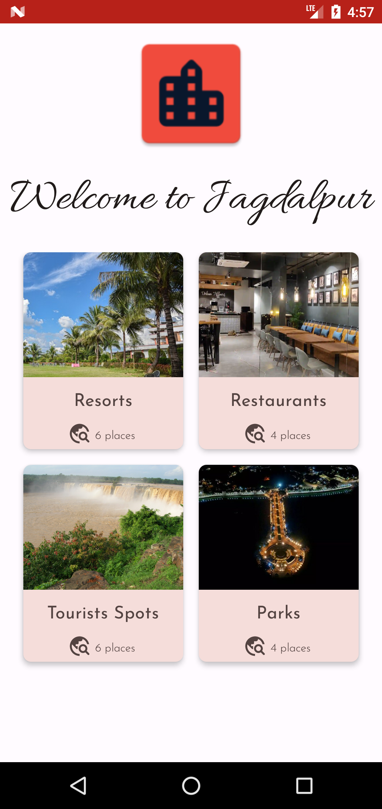
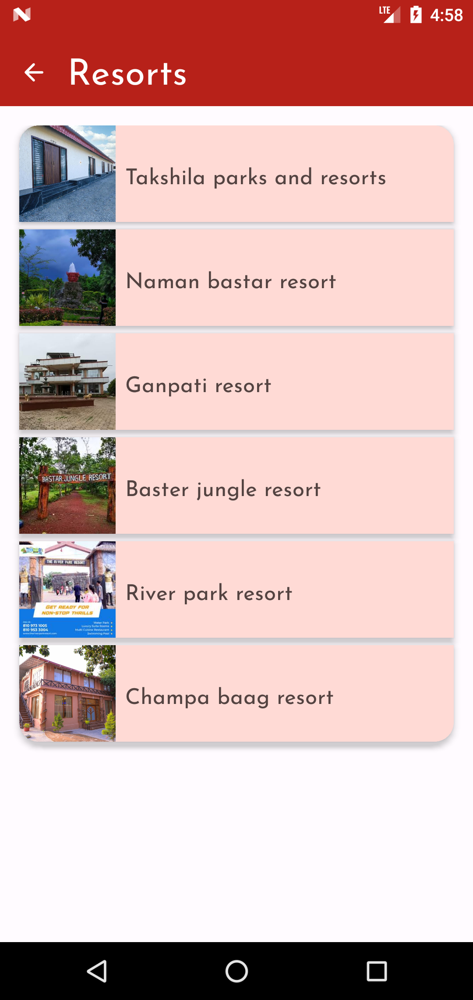
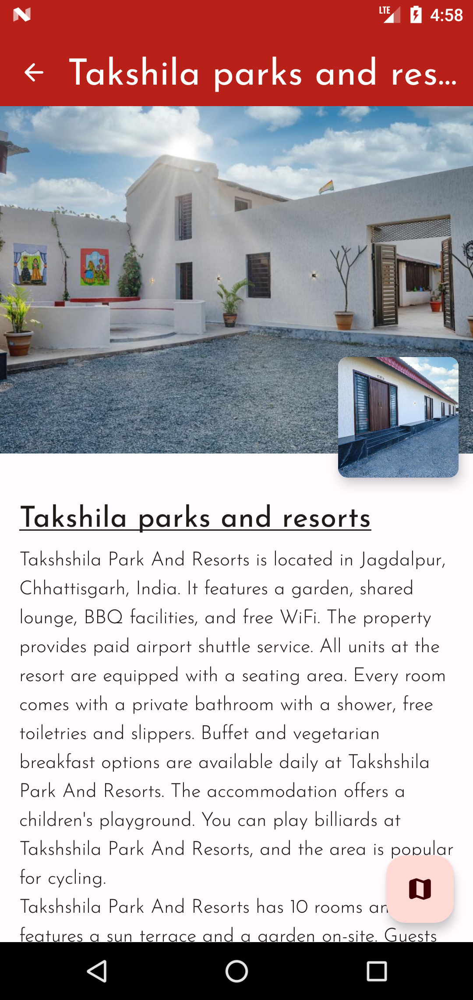

# AmchoJagdalpur Android App

AmchoJagdalpur is an Android app designed to showcase the beautiful city of Jagdalpur, Chhattisgarh. The app provides information about different types of places in Jagdalpur, allows users to explore a list of places based on their chosen type, and provides detailed information about each place.

## Features

- **Type of Places:** Discover various types of places in Jagdalpur, including tourist attractions, restaurants, parks, and more.
- **List of Places:** Browse a curated list of places in Jagdalpur based on the selected type.
- **Place Details:** Get detailed information about each place, including descriptions, images, and location.
- **User-Friendly Interface:** Enjoy a visually appealing and intuitive user interface for easy navigation and seamless user experience.

## Screenshots

    
    
    

## Installation

1. Download the APK file from the [releases](https://github.com/Indresh10/AmchoJagdalpur/releases) section of this repository.
2. Transfer the APK file to your Android device.
3. On your Android device, navigate to **Settings > Security** and enable **Unknown sources** to allow the installation of apps from sources other than the Play Store.
4. Use a file manager app to locate the APK file and tap on it to begin the installation.
5. Follow the on-screen instructions to install the AmchoJagdalpur app on your device.
6. Once installed, you can find the app icon on your home screen or app drawer.

## Usage

1. Launch the AmchoJagdalpur app by tapping on its icon.
2. On the home screen, select the type of place you want to explore.
3. Browse the list of places based on the selected type.
4. Tap on a place to view detailed information about it.
5. Use the integrated map functionality to locate the place.
6. Enjoy exploring the beautiful city of Jagdalpur through AmchoJagdalpur!

## Contributing

Contributions to AmchoJagdalpur are welcome! If you find any issues, have suggestions, or would like to add new features, please feel free to submit a pull request.

## License

This project is licensed under the [MIT License](LICENSE).
